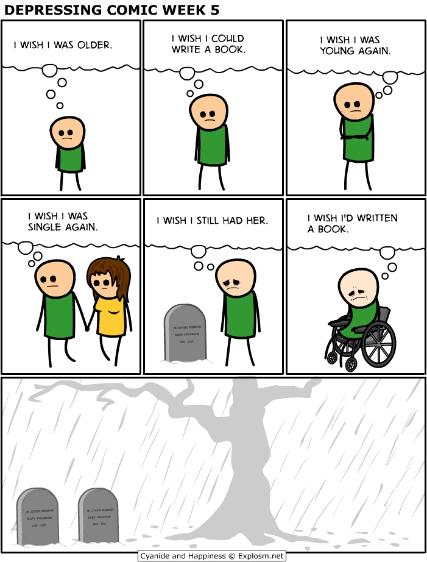

I hope you have a good time here. Thanks for dropping by.



# Background

**Education**{:#education}

    <figure style="padding-right:1%" itemprop="associatedMedia" itemscope itemtype="http://schema.org/ImageObject">
      
      <figcaption itemprop="caption description">
      </figcaption>
    </figure>

{{ site.photoswipe }}

<a id="investing-rules" href="javascript:;" id="dropdown" target="_self"><b>Investing Rules</b></a>

    
A few quick beliefs that guide my investing acumen &ndash;

    <ul>
        <li>Only invest in stocks or bonds. Real estate [1], gold, <a href="https://www.stephendiehl.com/blog.html">Bitcoin</a>, etc. are all scams long-term.</li>
        <li>Insider trading is <a href="https://www.capitoltrades.com/">rampant</a>. Never buy individual stocks. Only index funds like <a href="https://investor.vanguard.com/investment-products/etfs/profile/voo#overview">VOO</a>.</li>
        <li>The best companies remain private. Public companies focus on nothing but the next quarter to appease shareholders. So any individual stock you can buy is likely a long-term loser.</li>
        <li>Remember the <a href="https://river.com/learn/terms/c/cantillon-effect/">Cantillon Effect</a> &ndash; those closest to the money supply eat first and eat best.</li>
        <li>Check if <a href="https://fred.stlouisfed.org/series/MORTGAGE30US">interest rates</a> are at long-term highs or lows. If low, dollar-cost average into VOO [2]. When high (like present), cash out and buy <a href="https://client.schwab.com/Areas/Trade/FixedIncomeSearch/FISearch.aspx/TreasuryAuctions">T-Bills</a> for a 5-6% annual return.</li>
        <li>As a rule, never enter a position unless you're comfortable holding it for at least a year. Presently, all stocks but the "<a href="https://rogermartin.medium.com/the-magnificent-seven-stocks-16f9fd03a5b3">Magnificent Seven</a>" are trending downward, so stay out of stocks.</li>
        <li>Keep in mind that stock market returns from 1971 to 2018 were predicated on globalization and good relations with China. Post-Trump, this may no longer be possible.</li>
    </ul>
    <blockquote>"We should prepare ourselves for the possibility that this new economic reality will continue for <b>many years</b>. &nbsp;Higher interest rates lead to the economy running leaner, more geopolitical instability leads to more volatility, &nbsp;and increased regulation leads to slower growth and increased costs of innovation." &ndash; <a href="https://about.fb.com/news/2023/03/mark-zuckerberg-meta-year-of-efficiency/">Mark Zuckerberg</a></blockquote>
    <blockquote>"De-globalisation is real and gaining traction, despite the resilience of global trade over the past three years. &nbsp;With&nbsp;bilateral trade patterns starting to shift, and both the US and China using strategic industrial policy with a &nbsp;fair amount of success, there is no way back to the neoliberalism of the last 40 years." &ndash; <a href="https://www.theguardian.com/business/2023/sep/03/modis-unifying-message-for-the-g20-summit-looks-dated-as-globalisation-falls-apart">Dario Perkins</a></blockquote>
    <blockquote>"There is timing in the Way of the merchant, in the rise and fall of capital. All things entail rising and falling &nbsp;timing. You must be able to discern this." &ndash; <a href="https://www.goodreads.com/notes/31197112-the-book-of-five-rings/71655209-daniel-moore">Miyamoto Musashi</a></blockquote>
    
[1] Most people can only afford to buy one house &ndash; the one they live in. If you purchase a house for $500,000 and the price increases to a million, you've made money on paper, but all the other houses in your neighborhood have increased in price by the same amount, so you'll have to purchase a new house at the same inflated price (you need to live somewhere). Meaning you're breaking even at best. After interest payments and maintenance costs and realtor fees and property taxes, you've lost money.

    
[2] Be very careful when transitioning back into stocks from bonds. The worst of the 2008 crash happened after the pivot to lower rates. The Federal Reserve started cutting interest rates in 2007, and by January 30, 2008, it had reduced short-term interest rates to 3%, down from 5.25% in September 2007. Lehman Brothers collapsed in September 2008.

<a id="political-views" href="javascript:;" id="dropdown2" target="_self"><b>Political Views</b></a>

    
I'm broadly happy with the direction the U.S. is going, and look forward to many more years here. This is such a magical place. Everyone should at least visit.

    
Historical statements I believe &ndash;

    <ul>
        <li>The 20th century's most influential people were Lyndon Johnson, Mao Zedong, Joseph Stalin, Richard Nixon, Deng Xiaoping, Nikita Khrushchev, Mikhail Gorbachev, and Bill Clinton.</li>
        <li>In the 21st &ndash; Xi Jinping, Vladimir Putin, Donald Trump, George W. Bush, Barack Obama, Benjamin Netanyahu, Mark Zuckerberg, Steve Jobs, and Satya Nadella.</li>
        <li>Others in the late 20th were Ronald Reagan, Boris Yeltsin, Leonid Brezhnev, Indira Gandhi, Ho&nbsp;Chi Minh, Ruhollah Khomeini, Zia-ul-Haq, Qian Xuesen, Bill Gates, and Norman Borlaug.</li>
    </ul>
    
    
I left the U.S. some years ago, and am presently based in Mumbai. (Though I travel abroad often.) I've kept the American citizenship, but for the most part, I see myself as an Indian.

    
Some questions for the reader to ponder &ndash;

    <ul>
        <li>Your grandfather had two grandfathers. Can you name them? Are they forgotten?</li>
        <li>How much do you remember from school? Were decades of education worth it?</li>
        <li>Nothing prevents rent and food prices from going up to exactly what the median household can barely afford. Are you implicitly competing with others?</li>
    </ul>
    
Looking back a bit further (still in progress) &ndash;

    <ul>
        <li>The early 20th century's most influential people were Vladimir Lenin, Leon Trotsky, Wilhelm II, Sun Yat-Sen, Mohandas Gandhi, Franklin Roosevelt, Harry Truman, and Adolf Hitler.</li>
        <li>Others in the early 20th were Ismail Enver, Jinnah, David Ben-Gurion, Albert Einstein, Fritz Haber, Julius Rosenberg, Henry Ford, John Keynes, Philo Farnsworth, and the Wright Brothers.</li>
    </ul>
    
Further yet (still in progress) &ndash;

    <ul>
        <li>The late 19th century's most influential people were Victoria, Nathaniel Rothschild, Cixi, James Broun-Ramsey, Abraham Lincoln, Otto von Bismarck, Karl Marx, and Charles Darwin.</li>
        <li>Others in the late 19th were James Maxwell, Nikola Tesla, Thomas Edison, Carl Benz, Harriet Stowe, and Lev Tolstoy.</li>
    </ul>
    
Even further (still in progress) &ndash;

    <ul>
        <li>The early 19th century's most influential people included Napoleon Bonaparte, Toussaint Louverture, Michael Faraday, Samuel Morse, and Charles Dickens.</li>
        <li>The 18th century's most influential people included Robert Clive, George Washington, Maximilien Robespierre, Adam Smith, and Thomas Newcomen.</li>
    </ul>
    

# Favorite

{:#music}
**Music**

{% include yt.html width='77%' embed='
<iframe width="560" height="315" src="https://www.youtube.com/embed/playlist?list=PL1X3qTzT40VnGzBq2v2oKof9_Ps51ng5f" frameborder="0" gesture="media" allow="encrypted-media" allowfullscreen></iframe>
' %}

{:#consumer-goods}
**Consumer Goods**

* [AccuCheck Digital Body Weight Scale](https://www.amazon.com/gp/product/B084SFRSBD) (Measure often to avoid surprises.)
* [Alera High Performance Task Chair](https://www.amazon.com/gp/product/B01IIGMMW6) (My spine's best friend.)
* [AmazonBasics 8" Chef's Knife](https://www.amazon.com/dp/B09WW6VGHX) (Kitchen workhorse at an unbeatable price.)
* [Asus VS228H-P 21.5" 1080p Monitor](https://www.amazon.com/dp/B00MZ36J32) (Ideal bezel, size, and display ports for extended use.)
* [Bowflex SelectTech Adjustable Dumbbells](https://www.amazon.com/gp/product/B001ARYU58) (The first and last weight set you'll ever need.)
* [CAP Barbell Flat Weight Bench](https://www.amazon.com/dp/B01AGENTV6) (Essential for chest exercises.)
* [iBUYPOWER Pre-Built Gaming PC](https://www.ibuypower.com/gaming-pcs) (For work and play.)
* [Nike Men's Air Max 2090 Running Shoes](https://www.amazon.com/Nike-Stroke-Running-Anthracite-Reflect/dp/B08CZRY9XX) (A 1.5" height boost can come in handy.)
* [Pinguino Compact Portable Air Conditioner](https://www.delonghi.com/en-us/pac-em370-500-sq-ft-portable-air-conditioner-with-compact-design-and-eco-friendly-gas/p/PACEM370-6ALWH) (Makes working in the summer bearable.)
* [Redify Jump Rope](https://www.amazon.com/gp/product/B086XC32L2) (Who needs a treadmill?)
* [StriveZen 2-Month View Wall Calendar](https://www.amazon.com/Calendar-2019-2020-StriveZen-Monthly-Vertical/dp/B07T6C13JD) (Record weight, reps/sets, diet, important dates, etc.)
* [Vive Wrist Brace](https://www.amazon.com/gp/product/B077BPYK5S/) (Type for ten hours a day.)
* [ZNHIS Magnetic Bookmarks](https://www.amazon.com/gp/product/B0C1RTK2CK) (Avoids the mess of disposable paper bookmarks.)

{:#hobbyist-books}
**Hobbyist Books**

* [*How to Cook Everything: The Basics*](https://www.goodreads.com/notes/18897533-how-to-cook-everything/71655209-daniel-moore?ref=abp) by [Mark Bittman](https://markbittman.com/books) (Includes the steps most authors skip.)
* [*How to Eat*](https://www.goodreads.com/notes/48746181-how-to-eat/71655209-daniel-moore) by [Mark Bittman](https://markbittman.com/books) (Healthy living is a choice you make every day.)
* [*The Men's Health Big Book of Exercises*](https://www.amazon.com/gp/product/1623368413) by [Adam Campbell](https://www.linkedin.com/in/adamcampbellprofile/) (Endless workout variations.)

(For computer programming books, check out [this list](https://ebookfoundation.github.io/free-programming-books/books/free-programming-books-subjects.html). Supplement with [ChatGPT](https://chat.openai.com/?model=gpt-4).)

{:#philosophy-books}
**Philosophy Books**

* [*Certain to Win*](https://www.goodreads.com/notes/39774984-certain-to-win/71655209-daniel-moore) by [Chet Richards](https://slightlyeastofnew.com/page-1/) (How to outmaneuver and defeat much larger enemies.)
* [*The Complete Works*](/schopenhauer) by [Arthur Schopenhauer](https://en.wikipedia.org/wiki/Arthur_Schopenhauer) (Patron saint of intellectuals.)
* [*Disciplined Minds*](/disciplined-minds) by [Jeff Schmidt](https://disciplinedminds.tripod.com/) (Thriving in the white-collar workplace.)
* [*Feline Philosophy*](https://www.goodreads.com/notes/54106568-feline-philosophy/71655209-daniel-moore) by [John Gray](https://en.wikipedia.org/wiki/John_Gray_(philosopher)) (There is no higher goal than becoming a cat.)
* [*The 48 Laws of Power*](https://www.goodreads.com/notes/36548138-the-48-laws-of-power/71655209-daniel-moore) by [Robert Greene](https://en.wikipedia.org/wiki/Robert_Greene_(American_author)) (Either exercise power or have it exercised on you.)
* [*Lectures on Physics*](https://www.feynmanlectures.caltech.edu/) by [Richard Feynman](https://en.wikipedia.org/wiki/Richard_Feynman) (Our perceptions merely approximate reality.)
* [*Natural Causes*](https://www.goodreads.com/notes/38714645-natural-causes/71655209-daniel-moore) by [Barbara Ehrenreich](https://en.wikipedia.org/wiki/Barbara_Ehrenreich) (Living in fear of death is worse than dying.)
* [*Straw Dogs*](https://www.goodreads.com/notes/29767507-straw-dogs/71655209-daniel-moore) by [John Gray](https://en.wikipedia.org/wiki/John_Gray_(philosopher)) (Giving up hope of "ultimate meaning" is the secret to happiness.)
* [*The Trouble with Being Born*](https://www.goodreads.com/notes/50757709-the-trouble-with-being-born/71655209-daniel-moore) by [Emil Cioran](https://en.wikipedia.org/wiki/Emil_Cioran) (Resignation is only the beginning.)
* [*We Have No Idea*](https://www.goodreads.com/notes/32885051-we-have-no-idea/71655209-daniel-moore) by [Jorge Cham](https://jorgecham.com/) (Probing the edges of scientific knowledge.)
* [*Zero to One*](https://www.goodreads.com/notes/37653154-zero-to-one/71655209-daniel-moore) by [Peter Thiel](https://en.wikipedia.org/wiki/Peter_Thiel) (Push the boundaries of what's possible, or don't even start.)

{:#economics-books}
**Economics Books**

* [*Bullshit Jobs*](https://www.goodreads.com/notes/38217638-bullshit-jobs/71655209-daniel-moore) by [David Graeber](https://en.wikipedia.org/wiki/David_Graeber) (Work is more about social control than actual work.)
* [*The Case Against Education*](https://www.goodreads.com/notes/52147324-the-case-against-education/71655209-daniel-moore) by [Bryan Caplan](http://www.bcaplan.com/) (We waste a third of our lives social signaling.)
* [*The End of Work*](https://www.amazon.com/gp/product/0874778247) by [Jeremy Rifkin](https://en.wikipedia.org/wiki/Jeremy_Rifkin) (Technology causes poverty.)
* [*The Gervais Principle*](https://www.ribbonfarm.com/2009/10/07/the-gervais-principle-or-the-office-according-to-the-office/#content) by [Venkatesh Rao](https://www.ribbonfarm.com/now-reading/#content) (Organizational politics demystified.)
* [*Open Borders*](https://www.amazon.com/dp/1250316960) by [Bryan Caplan](https://en.wikipedia.org/wiki/Bryan_Caplan) (Immigration restrictions make no economic sense.)
* [*Planet of Slums*](https://www.goodreads.com/notes/18878154-planet-of-slums/71655209-daniel-moore) by [Mike Davis](https://en.wikipedia.org/wiki/Mike_Davis_(scholar)) (The median human being lives in a slum.)
* [*River Out of Eden*](https://www.goodreads.com/notes/19196310-river-out-of-eden/71655209-daniel-moore) by [Richard Dawkins](https://en.wikipedia.org/wiki/Richard_Dawkins) (Suffering and scarcity are built into the system.)
* [*Screen Schooled*](https://www.goodreads.com/notes/36357274-screen-schooled/71655209-daniel-moore) by [Joe Clement](http://screenschooled.com/aboutauthors/) (Social media and TV have ruined multiple generations.)
* [*The Singularity Is Near*](https://www.goodreads.com/notes/5804507-the-singularity-is-near/71655209-daniel-moore) by [Ray Kurzweil](https://en.wikipedia.org/wiki/Ray_Kurzweil) (I, for one, welcome our new AI overlords.)
* [*The Uninhabitable Earth*](https://www.goodreads.com/notes/43373984-the-uninhabitable-earth/71655209-daniel-moore) by [David Wallace-Wells](https://www.nytimes.com/column/david-wallace-wells) (Global climate change will ruin everything.)
* [*Untrue: Women, Lust, and Infidelity*](https://www.goodreads.com/notes/38907660-untrue/71655209-daniel-moore) by [Wednesday Martin](https://en.wikipedia.org/wiki/Wednesday_Martin) (Primate dating market dynamics.)

{:#history-books}
**History Books**

* [*100 Decisive Battles*](https://www.amazon.com/gp/product/0195143663) by [Paul Davis](https://en.wikipedia.org/wiki/Paul_K._Davis_(historian)) (We are puppets dancing on our predecessors' strings.)
* [*Born in Blackness*](https://www.goodreads.com/notes/57777449-born-in-blackness/71655209-daniel-moore) by [Howard French](https://en.wikipedia.org/wiki/Howard_W._French) (African slaves built Western civilization.)
* [*Debt: The First 5,000 Years*](https://www.goodreads.com/notes/23814811-debt---updated-and-expanded/71655209-daniel-moore) by [David Graeber](https://en.wikipedia.org/wiki/David_Graeber) (Modern finance is rooted in medieval Europe.)
* [*Early Indians*](https://www.amazon.com/gp/product/9391165958) by [Tony Joseph](https://twitter.com/tjoseph0010) (Genomics-based insights into 65,000 years of India's history.)
* [*The Emperor of All Maladies*](https://www.goodreads.com/notes/9667124-the-emperor-of-all-maladies/71655209-daniel-moore) by [Siddhartha Mukherjee](https://en.wikipedia.org/wiki/Siddhartha_Mukherjee) (Understanding cancer.)
* [*The Great Convergence*](https://www.goodreads.com/notes/33287012-the-great-convergence/71655209-daniel-moore) by [Richard Baldwin](https://en.wikipedia.org/wiki/Richard_Baldwin_(economist)) (Wealth's journey from East to West and back.)
* [*Late Victorian Holocausts*](https://www.goodreads.com/notes/19323009-late-victorian-holocausts/71655209-daniel-moore) by [Mike Davis](https://en.wikipedia.org/wiki/Mike_Davis_(scholar)) (50 million forgotten murders.)
* [*Modern India: 1885-1947*](https://www.amazon.com/gp/product/9332535744) by [Sumit Sarkar](https://en.wikipedia.org/wiki/Sumit_Sarkar) (Nationalism, religion, and caste in the British Raj.)
* [*Montaillou*](https://www.amazon.com/gp/product/0807616133) by [Emmanuel Ladurie](https://en.wikipedia.org/wiki/Emmanuel_Le_Roy_Ladurie) (Based on [actual interviews](https://en.wikipedia.org/wiki/Fournier_Register) with medieval peasants.)
* [*Reconstruction*](https://www.goodreads.com/notes/11389556-reconstruction/71655209-daniel-moore) by [Eric Foner](https://en.wikipedia.org/wiki/Eric_Foner) (Ongoing ripples of Lincoln's assassination.)
* [*The Secret History of the First World War*](https://www.goodreads.com/notes/21227216-hidden-history/71655209-daniel-moore) by [Gerry Dooherty](https://firstworldwarhiddenhistory.wordpress.com/about-the-authors/gerry-docherty/) (Empire devours itself.)
* [*The Shadow of the Great Game*](https://www.goodreads.com/notes/35993782-the-shadow-of-the-great-game/71655209-daniel-moore) by [Narendra Sarila](https://books.google.com/books/about/The_Untold_Story_Of_India_Partition_The.html?id=4_2CpwAACAAJ&source=kp_author_description#about_author) (Pakistan's Cold War origins.)
* [*Stalin*](https://static1.squarespace.com/static/5ed33bcd368e221ec227cacd/t/5ee39a1731781f54f197c5f7/1591974443348/Domenico+Losurdo+-+Stalin.pdf) by [Domenico Losurdo](https://en.wikipedia.org/wiki/Domenico_Losurdo) (Perhaps the 20th century's most influential person.)
* [*Vladimir Putin and Russian Statecraft*](https://www.goodreads.com/notes/19441321-vladimir-putin-and-russian-statecraft/71655209-daniel-moore) by [Allen Lynch](https://politics.virginia.edu/people/profile/al4u) (From failed state to world power.)
 
{:#historical-documents}
**Historical Documents**

* "[The ABC of Communism](https://www.marxists.org/archive/bukharin/works/1920/abc/)" by [Nikolai Bukharin](https://en.wikipedia.org/wiki/Nikolai_Bukharin) (Primer on what tens of millions died for.)
* "[Address to the Nation After 9/11](https://press.uchicago.edu/Misc/Chicago/481921texts.html)" by [George W. Bush](https://en.wikipedia.org/wiki/George_W._Bush) (Prelude to 20 years of war.)
* "[Asia After Viet Nam](https://cdn.nixonlibrary.org/01/wp-content/uploads/2017/01/11113807/Asia-After-Viet-Nam.pdf)" by [Richard Nixon](https://en.wikipedia.org/wiki/Richard_Nixon) (Sino-American rapprochement.)
* "[Attention Is All You Need](https://arxiv.org/pdf/1706.03762.pdf)" by [Google Brain](https://en.wikipedia.org/wiki/Google_Brain) (Invented modern artificial intelligence.)
* "[From a China Traveler](https://www.nytimes.com/1973/08/10/archives/from-a-china-traveler.html)" by [David Rockefeller](https://en.wikipedia.org/wiki/David_Rockefeller) (Neoliberal honeymoon.)
* "[The Minority Nationalities in the Southwest](https://dengxiaopingworks.wordpress.com/2013/02/22/the-question-of-minority-nationalities-in-the-southwest/)" by [Deng Xiaoping](https://en.wikipedia.org/wiki/Deng_Xiaoping) (How to build a nation.)
* "[Modernize and Never Seek Hegemony](https://dengxiaopingworks.wordpress.com/2013/02/25/realize-the-four-modernizations-and-never-seek-hegemony)" by [Deng Xiaoping](https://en.wikipedia.org/wiki/Deng_Xiaoping) (Father of globalization.)
* "[On Contradiction](https://www.marxists.org/reference/archive/mao/selected-works/volume-1/mswv1_17.htm)" by [Mao Zedong](https://en.wikipedia.org/wiki/Mao_Zedong) (Set the basis of modern Chinese thought.)
* "[On the Historical Unity of Russians and Ukrainians](http://en.kremlin.ru/events/president/news/66181)" by [Vladimir Putin](https://en.wikipedia.org/wiki/Vladimir_Putin) (Tsardom [reborn](https://yasha.substack.com/p/welcome-to-the-ruzzkiy-mir).)
* "[Remarks on the End of the War in Afghanistan](https://www.whitehouse.gov/briefing-room/speeches-remarks/2021/08/31/remarks-by-president-biden-on-the-end-of-the-war-in-afghanistan/#:~:text=After%20more%20than%20%242%20trillion,a%20day%20for%20two%20decades.)" by [Joe Biden](https://en.wikipedia.org/wiki/Joe_Biden) (Graveyard of empires.)
* "[The Social Responsibility of Business](https://www.nytimes.com/1970/09/13/archives/a-friedman-doctrine-the-social-responsibility-of-business-is-to.html)" by [Milton Friedman](https://en.wikipedia.org/wiki/Milton_Friedman) (Death knell for the welfare state.)
* "[Speech on China Trade Bill](https://archive.nytimes.com/www.nytimes.com/library/world/asia/030900clinton-china-text.html)" by [Bill Clinton](https://en.wikipedia.org/wiki/Bill_Clinton) (Birth of the Chinese Century.)

{:#autobiographies}
**Autobiographies**

* [*Cinema Speculation*](https://www.goodreads.com/notes/61198870-cinema-speculation/71655209-daniel-moore) by [Quentin Tarantino](https://en.wikipedia.org/wiki/Quentin_Tarantino) (Watch the films as you read to fully get it.)
* [*Four Star Reviews, 1967-2007*](https://www.goodreads.com/notes/9517283-roger-ebert-s-four-star-reviews-1967-2007/71655209-daniel-moore) by [Roger Ebert](https://en.wikipedia.org/wiki/Roger_Ebert) (40 years at the movies.)
* [*Hit Refresh*](https://www.goodreads.com/notes/31139580-hit-refresh/71655209-daniel-moore) by [Satya Nadella](https://www.youtube.com/watch?v=UNbyT7wPwk4&t=791s) (Good leadership is providing ways for others to excel.)
* [*Revolutionary Suicide*](https://www.goodreads.com/notes/8176686-revolutionary-suicide/71655209-daniel-moore) by [Huey Newton](https://en.wikipedia.org/wiki/Huey_Newton) (Rising up against the system is usually martyrdom.)
* [*What Happened*](https://www.goodreads.com/notes/34114362-what-happened/71655209-daniel-moore) by [Hillary Clinton](https://en.wikipedia.org/wiki/Hillary_Clinton) (Her electoral losses defined the 21st century.)

{:#novels}
**Novels**

* [*A Clash of Kings*](https://www.goodreads.com/notes/6584437-a-clash-of-kings/71655209-daniel-moore) by [George R. R. Martin](https://en.wikipedia.org/wiki/George_R._R._Martin) (Living history is written in blood.)
* [*The Haj*](https://www.amazon.com/Haj-Leon-Uris/dp/0385034598) by [Leon Uris](https://en.wikipedia.org/wiki/Leon_Uris) (Israeli history from a Jewish perspective.)
* [*The House of God*](https://www.goodreads.com/notes/10562200-the-house-of-god/71655209-daniel-moore) by [Samuel Shem](https://en.wikipedia.org/wiki/Samuel_Shem) (Only [57%](https://www.ama-assn.org/practice-management/physician-health/pandemic-s-wake-only-57-doctors-would-choose-medicine-again) of doctors would go into medicine again.)
* [*Invisible Man*](https://www.goodreads.com/notes/50176777-invisible-man/71655209-daniel-moore) by [Ralph Ellison](https://en.wikipedia.org/wiki/Ralph_Ellison) (Written in 1952 &ndash; still describes U.S. race relations today.)
* [*The Long Walk*](https://www.goodreads.com/notes/28165439-the-long-walk/71655209-daniel-moore) by [Stephen King](https://en.wikipedia.org/wiki/Stephen_King) (Masculinity in a nutshell.)
* [*Microserfs*](https://www.goodreads.com/notes/11483124-microserfs/71655209-daniel-moore) by [Douglas Coupland](https://en.wikipedia.org/wiki/Douglas_Coupland) (Worker's-eye view of Silicon Valley pre-dot-com boom.)
* [*Pet Sematary*](https://www.goodreads.com/notes/45030607-pet-sematary/71655209-daniel-moore) by [Stephen King](https://en.wikipedia.org/wiki/Stephen_King) (Death makes a mockery of everything.)
* [*The Stars My Destination*](https://www.goodreads.com/notes/61330329-the-stars-my-destination/71655209-daniel-moore) by [Alfred Bester](https://en.wikipedia.org/wiki/Alfred_Bester) (Hypnotic in its intensity.)
* [*Submission*](https://www.goodreads.com/notes/25349247-submission/71655209-daniel-moore) by [Michel Houellebecq](https://en.wikipedia.org/wiki/Michel_Houellebecq) (Prescient satire of the "end of history".)
* [*Things Fall Apart*](https://www.goodreads.com/notes/55468022-things-fall-apart/71655209-daniel-moore) by [Chinua Achebe](https://en.wikipedia.org/wiki/Chinua_Achebe) (Surreal reflections on Western imperialism.)
* [*The White Tiger*](https://www.goodreads.com/notes/32574786-the-white-tiger/71655209-daniel-moore) by [Aravind Adiga](https://en.wikipedia.org/wiki/Aravind_Adiga) (Required reading for the Indian diaspora.)

{:#short-stories}
**Short Stories**

* "[American Gold Mine](https://windupstories.com/books-short-stories/american-gold-mine/)" by [Paolo Bacigalupi](https://windupstories.com/) (Any professional can relate.)
* "[Coding Machines](https://www.teamten.com/lawrence/writings/coding-machines/#coding_machines)" by [Lawrence Kesteloot](https://www.teamten.com/lawrence/) (Man's reach exceeds his grasp.)
* "[The Cold Equations](http://www.spacewesterns.com/articles/105/#content)" by [Tom Godwin](https://en.wikipedia.org/wiki/Tom_Godwin) (You can't outsmart physics.)
* "[Fleep](http://www.aaronsw.com/2002/fleep/)" by [Jason Shiga](https://en.wikipedia.org/wiki/Jason_Shiga) (If you lose your memories, are you still the same person?)
* "[Frost and Fire](http://web.archive.org/web/20170918083727/https://charlton6.weebly.com/uploads/1/0/6/2/10621939/frost_and_fire.pdf)" by [Ray Bradbury](https://en.wikipedia.org/wiki/Ray_Bradbury) (Man that is born of a woman is of few days.)
* "[A Full Life](https://www.technologyreview.com/2019/04/24/135741/a-full-life/)" by [Paolo Bacigalupi](https://windupstories.com/) (Pre-COVID depictions of dystopia seem optimistic now.)
* "[Golden](https://nickbostrom.com/fable/retriever.html)" by [Nick Bostrom](https://en.wikipedia.org/wiki/Nick_Bostrom) (Animals are trapped in a real-life horror movie.)
* "[A Hunger Artist](https://www.kafka-online.info/a-hunger-artist.html)" by [Franz Kafka](https://en.wikipedia.org/wiki/Franz_Kafka) (The best gifts find the fewest admirers.)
* "[Yellow Card Man](https://www.goodreads.com/notes/41758281-pump-six-and-other-stories/71655209-daniel-moore)" by [Paolo Bacigalupi](https://windupstories.com/) (In the end, you're alone.)

{:#comic-books}
**Comic Books**

* [*Buddha*](https://archive.org/details/manga_Buddha-v01) by [Osamu Tezuka](https://en.wikipedia.org/wiki/Osamu_Tezuka) (Existence is a fever dream, and the self is an illusion.)
* [*Invincible*](https://getcomics.org/other-comics/invincible-compendium-vol-1-2013-2019/) by [Robert Kirkman](https://en.wikipedia.org/wiki/Robert_Kirkman) (Thrilling visions of U.S.-led, post-racial multilateralism.)
* [*Sandcastle*](https://www.amazon.com/Sandcastle-new-preface-Original-Fiction-ebook/dp/B097YWJMQF) by [Pierre Oscar Levy](https://fr.wikipedia.org/wiki/Pierre_Oscar_L%C3%A9vy) (Life's a beach and then you die.)
* [*The Sandman*](https://getcomics.org/dc/the-sandman-1-75-extras/) by [Neil Gaiman](https://en.wikipedia.org/wiki/Neil_Gaiman) (Failing to grow can be fatal. Pair with the [companion](https://www.amazon.com/gp/product/1563894653).)
* [*Spider-Man: India*](https://www.amazon.com/gp/product/180491133X) by [Jeevan Kang](https://en.wikipedia.org/wiki/Jeevan_Kang) ("Teenage superhero" is an infinitely malleable archetype.)
* [*Swamp Thing*](https://getcomics.org/dc/saga-of-the-swamp-thing-vol-1-6/) by [Alan Moore](https://en.wikipedia.org/wiki/Alan_Moore) (It's better to be a plant than an animal.)
* [*Yossel: April 19, 1943*](https://www.amazon.com/gp/product/074347516X) by [Joe Kubert](https://en.wikipedia.org/wiki/Joe_Kubert) (When the state is your enemy, there's nowhere to run.)

<figure itemprop="associatedMedia" itemscope itemtype="http://schema.org/ImageObject"><figcaption itemprop="caption description">
<i>Buddha</i> by Osamu Tezuka
</figcaption></figure>
<figure itemprop="associatedMedia" style="display:none" itemscope itemtype="http://schema.org/ImageObject"><figcaption itemprop="caption description"></figcaption></figure>
<figure itemprop="associatedMedia" style="display:none" itemscope itemtype="http://schema.org/ImageObject"><figcaption itemprop="caption description"></figcaption></figure>
<figure itemprop="associatedMedia" style="display:none" itemscope itemtype="http://schema.org/ImageObject"><figcaption itemprop="caption description"></figcaption></figure>
<figure itemprop="associatedMedia" style="display:none" itemscope itemtype="http://schema.org/ImageObject"><figcaption itemprop="caption description"></figcaption></figure>
<figure itemprop="associatedMedia" style="display:none" itemscope itemtype="http://schema.org/ImageObject"><figcaption itemprop="caption description"></figcaption></figure>
<figure itemprop="associatedMedia" style="display:none" itemscope itemtype="http://schema.org/ImageObject"><figcaption itemprop="caption description"></figcaption></figure>

<figure itemprop="associatedMedia" itemscope itemtype="http://schema.org/ImageObject"><figcaption itemprop="caption description">
<i>Buddha</i> by Osamu Tezuka
</figcaption></figure>
<figure itemprop="associatedMedia" style="display:none" itemscope itemtype="http://schema.org/ImageObject"><figcaption itemprop="caption description"></figcaption></figure>
<figure itemprop="associatedMedia" style="display:none" itemscope itemtype="http://schema.org/ImageObject"><figcaption itemprop="caption description"></figcaption></figure>
<figure itemprop="associatedMedia" style="display:none" itemscope itemtype="http://schema.org/ImageObject"><figcaption itemprop="caption description"></figcaption></figure>
<figure itemprop="associatedMedia" style="display:none" itemscope itemtype="http://schema.org/ImageObject"><figcaption itemprop="caption description"></figcaption></figure>
<figure itemprop="associatedMedia" style="display:none" itemscope itemtype="http://schema.org/ImageObject"><figcaption itemprop="caption description"></figcaption></figure>

<figure itemprop="associatedMedia" itemscope itemtype="http://schema.org/ImageObject"><figcaption itemprop="caption description">
<i>Buddha</i> by Osamu Tezuka
</figcaption></figure>
<figure itemprop="associatedMedia" style="display:none" itemscope itemtype="http://schema.org/ImageObject"></figcaption></figure>
<figure itemprop="associatedMedia" style="display:none" itemscope itemtype="http://schema.org/ImageObject"></figcaption></figure>
<figure itemprop="associatedMedia" style="display:none" itemscope itemtype="http://schema.org/ImageObject"></figcaption></figure>

<figure itemprop="associatedMedia" itemscope itemtype="http://schema.org/ImageObject"><figcaption itemprop="caption description">
<i>Buddha</i> by Osamu Tezuka
</figcaption></figure>
<figure itemprop="associatedMedia" style="display:none" itemscope itemtype="http://schema.org/ImageObject"></figcaption></figure>
<figure itemprop="associatedMedia" style="display:none" itemscope itemtype="http://schema.org/ImageObject"></figcaption></figure>

<figure itemprop="associatedMedia" itemscope itemtype="http://schema.org/ImageObject"><figcaption itemprop="caption description">
<i>Buddha</i> by Osamu Tezuka
</figcaption></figure>
<figure itemprop="associatedMedia" style="display:none" itemscope itemtype="http://schema.org/ImageObject"></figcaption></figure>
<figure itemprop="associatedMedia" style="display:none" itemscope itemtype="http://schema.org/ImageObject"></figcaption></figure>

<figure itemprop="associatedMedia" itemscope itemtype="http://schema.org/ImageObject"><figcaption itemprop="caption description">
<i>Buddha</i> by Osamu Tezuka
</figcaption></figure>
<figure itemprop="associatedMedia" style="display:none" itemscope itemtype="http://schema.org/ImageObject"></figcaption></figure>
<figure itemprop="associatedMedia" style="display:none" itemscope itemtype="http://schema.org/ImageObject"></figcaption></figure>

<figure itemprop="associatedMedia" itemscope itemtype="http://schema.org/ImageObject"><figcaption itemprop="caption description">
<i>Buddha</i> by Osamu Tezuka
</figcaption></figure>
<figure itemprop="associatedMedia" style="display:none" itemscope itemtype="http://schema.org/ImageObject">
<i>Buddha</i> by Osamu Tezuka
</figcaption></figure>
<figure itemprop="associatedMedia" style="display:none" itemscope itemtype="http://schema.org/ImageObject">
<i>Death Note</i> by Oba Tsugumi
</figcaption></figure>
<figure itemprop="associatedMedia" style="display:none" itemscope itemtype="http://schema.org/ImageObject">
<i>Habibi</i> by Craig Thompson
</figcaption></figure>
<figure itemprop="associatedMedia" style="display:none" itemscope itemtype="http://schema.org/ImageObject">
<i>Johnny the Homicidal Maniac</i> by Jhonen Vasquez
</figcaption></figure>
<figure itemprop="associatedMedia" style="display:none" itemscope itemtype="http://schema.org/ImageObject">
<i>Batman: The Killing Joke</i> by Alan Moore
</figcaption></figure>
<figure itemprop="associatedMedia" style="display:none" itemscope itemtype="http://schema.org/ImageObject">
<i>The League of Extraordinary Gentlemen</i> by Alan Moore
</figcaption></figure>
<figure itemprop="associatedMedia" style="display:none" itemscope itemtype="http://schema.org/ImageObject">
<i>Loving Reaper</i> by Jenny Jinya
</figcaption></figure>
<figure itemprop="associatedMedia" style="display:none" itemscope itemtype="http://schema.org/ImageObject">
<i>New X-Men</i> by Grant Morrison
</figcaption></figure>
<figure itemprop="associatedMedia" style="display:none" itemscope itemtype="http://schema.org/ImageObject">
<i>Open Borders</i> by Bryan Caplan
</figcaption></figure>
<figure itemprop="associatedMedia" style="display:none" itemscope itemtype="http://schema.org/ImageObject">
<i>Portal 2: Lab Rat</i> by Ted Kosmatka
</figcaption></figure>
<figure itemprop="associatedMedia" style="display:none" itemscope itemtype="http://schema.org/ImageObject">
<i>The Sculptor</i> by Scott McCloud
</figcaption></figure>
<figure itemprop="associatedMedia" style="display:none" itemscope itemtype="http://schema.org/ImageObject">
<i>Strange Embrace</i> by David Hine
</figcaption></figure>
<figure itemprop="associatedMedia" style="display:none" itemscope itemtype="http://schema.org/ImageObject">
<i>All-Star Superman</i> by Grant Morrison
</figcaption></figure>
<figure itemprop="associatedMedia" style="display:none" itemscope itemtype="http://schema.org/ImageObject">
<i>Swamp Thing</i> by Alan Moore
</figcaption></figure>

<figure itemprop="associatedMedia" itemscope itemtype="http://schema.org/ImageObject"><figcaption itemprop="caption description">
<i>Buddha</i> by Osamu Tezuka
</figcaption></figure>
<figure itemprop="associatedMedia" style="display:none" itemscope itemtype="http://schema.org/ImageObject"></figcaption></figure>
<figure itemprop="associatedMedia" style="display:none" itemscope itemtype="http://schema.org/ImageObject"></figcaption></figure>

<figure itemprop="associatedMedia" itemscope itemtype="http://schema.org/ImageObject"><figcaption itemprop="caption description">
<i>Sandcastle</i> by Pierre Levy
</figcaption></figure>
<figure itemprop="associatedMedia" style="display:none" itemscope itemtype="http://schema.org/ImageObject"><figcaption itemprop="caption description"></figcaption></figure>
<figure itemprop="associatedMedia" style="display:none" itemscope itemtype="http://schema.org/ImageObject"><figcaption itemprop="caption description"></figcaption></figure>
<figure itemprop="associatedMedia" style="display:none" itemscope itemtype="http://schema.org/ImageObject"><figcaption itemprop="caption description"></figcaption></figure>
<figure itemprop="associatedMedia" style="display:none" itemscope itemtype="http://schema.org/ImageObject"><figcaption itemprop="caption description"></figcaption></figure>

<figure itemprop="associatedMedia" itemscope itemtype="http://schema.org/ImageObject"><figcaption itemprop="caption description">
<i>Sandcastle</i> by Pierre Levy
</figcaption></figure>
<figure itemprop="associatedMedia" style="display:none" itemscope itemtype="http://schema.org/ImageObject"><figcaption itemprop="caption description"></figcaption></figure>
<figure itemprop="associatedMedia" style="display:none" itemscope itemtype="http://schema.org/ImageObject"><figcaption itemprop="caption description"></figcaption></figure>
<figure itemprop="associatedMedia" style="display:none" itemscope itemtype="http://schema.org/ImageObject"><figcaption itemprop="caption description"></figcaption></figure>

<figure itemprop="associatedMedia" itemscope itemtype="http://schema.org/ImageObject"><figcaption itemprop="caption description">
<i>Understanding Comics</i> by Scott McCloud
</figcaption></figure>
<figure itemprop="associatedMedia" style="display:none" itemscope itemtype="http://schema.org/ImageObject"></figcaption></figure>
<figure itemprop="associatedMedia" style="display:none" itemscope itemtype="http://schema.org/ImageObject"></figcaption></figure>
<figure itemprop="associatedMedia" style="display:none" itemscope itemtype="http://schema.org/ImageObject"></figcaption></figure>
<figure itemprop="associatedMedia" style="display:none" itemscope itemtype="http://schema.org/ImageObject"></figcaption></figure>
<figure itemprop="associatedMedia" style="display:none" itemscope itemtype="http://schema.org/ImageObject"></figcaption></figure>



<figure itemprop="associatedMedia" itemscope itemtype="http://schema.org/ImageObject"><figcaption itemprop="caption description">
<i>Buddha</i> by Osamu Tezuka
</figcaption></figure>
<figure itemprop="associatedMedia" style="display:none" itemscope itemtype="http://schema.org/ImageObject"></figcaption></figure>
<figure itemprop="associatedMedia" style="display:none" itemscope itemtype="http://schema.org/ImageObject"></figcaption></figure>
<figure itemprop="associatedMedia" style="display:none" itemscope itemtype="http://schema.org/ImageObject"></figcaption></figure>

<figure itemprop="associatedMedia" itemscope itemtype="http://schema.org/ImageObject"><figcaption itemprop="caption description">
<i>Invincible</i> by Robert Kirkman
</figcaption></figure>
<figure itemprop="associatedMedia" style="display:none" itemscope itemtype="http://schema.org/ImageObject"></figcaption></figure>
<figure itemprop="associatedMedia" style="display:none" itemscope itemtype="http://schema.org/ImageObject"></figcaption></figure>
<figure itemprop="associatedMedia" style="display:none" itemscope itemtype="http://schema.org/ImageObject"></figcaption></figure>
<figure itemprop="associatedMedia" style="display:none" itemscope itemtype="http://schema.org/ImageObject"></figcaption></figure>

<figure itemprop="associatedMedia" itemscope itemtype="http://schema.org/ImageObject"><figcaption itemprop="caption description">
<i>The Walking Dead</i> by Robert Kirkman
</figcaption></figure>
<figure itemprop="associatedMedia" style="display:none" itemscope itemtype="http://schema.org/ImageObject"></figcaption></figure>
<figure itemprop="associatedMedia" style="display:none" itemscope itemtype="http://schema.org/ImageObject"></figcaption></figure>
<figure itemprop="associatedMedia" style="display:none" itemscope itemtype="http://schema.org/ImageObject"></figcaption></figure>
<figure itemprop="associatedMedia" style="display:none" itemscope itemtype="http://schema.org/ImageObject"></figcaption></figure>
<figure itemprop="associatedMedia" style="display:none" itemscope itemtype="http://schema.org/ImageObject"></figcaption></figure>
<figure itemprop="associatedMedia" style="display:none" itemscope itemtype="http://schema.org/ImageObject"></figcaption></figure>

<figure itemprop="associatedMedia" itemscope itemtype="http://schema.org/ImageObject"><figcaption itemprop="caption description">
<i>The Sandman</i> by Neil Gaiman
</figcaption></figure>
<figure itemprop="associatedMedia" style="display:none" itemscope itemtype="http://schema.org/ImageObject"></figcaption></figure>
<figure itemprop="associatedMedia" style="display:none" itemscope itemtype="http://schema.org/ImageObject"></figcaption></figure>
<figure itemprop="associatedMedia" style="display:none" itemscope itemtype="http://schema.org/ImageObject"></figcaption></figure>
<figure itemprop="associatedMedia" style="display:none" itemscope itemtype="http://schema.org/ImageObject"></figcaption></figure>

<figure itemprop="associatedMedia" itemscope itemtype="http://schema.org/ImageObject"><figcaption itemprop="caption description">
<i>Invincible</i> by Robert Kirkman
</figcaption></figure>
<figure itemprop="associatedMedia" style="display:none" itemscope itemtype="http://schema.org/ImageObject"></figcaption></figure>
<figure itemprop="associatedMedia" style="display:none" itemscope itemtype="http://schema.org/ImageObject"></figcaption></figure>

<figure itemprop="associatedMedia" itemscope itemtype="http://schema.org/ImageObject"><figcaption itemprop="caption description">
<i>The Sandman</i> by Neil Gaiman
</figcaption></figure>
<figure itemprop="associatedMedia" style="display:none" itemscope itemtype="http://schema.org/ImageObject"></figcaption></figure>
<figure itemprop="associatedMedia" style="display:none" itemscope itemtype="http://schema.org/ImageObject"></figcaption></figure>
<figure itemprop="associatedMedia" style="display:none" itemscope itemtype="http://schema.org/ImageObject"></figcaption></figure>



<figure itemprop="associatedMedia" itemscope itemtype="http://schema.org/ImageObject"><figcaption itemprop="caption description"></figcaption></figure>
<figure itemprop="associatedMedia" style="display:none" itemscope itemtype="http://schema.org/ImageObject"></figcaption></figure>
<figure itemprop="associatedMedia" style="display:none" itemscope itemtype="http://schema.org/ImageObject"></figcaption></figure>
<figure itemprop="associatedMedia" style="display:none" itemscope itemtype="http://schema.org/ImageObject"></figcaption></figure>
<figure itemprop="associatedMedia" style="display:none" itemscope itemtype="http://schema.org/ImageObject"></figcaption></figure>
<figure itemprop="associatedMedia" style="display:none" itemscope itemtype="http://schema.org/ImageObject"></figcaption></figure>
<figure itemprop="associatedMedia" style="display:none" itemscope itemtype="http://schema.org/ImageObject"></figcaption></figure>
<figure itemprop="associatedMedia" style="display:none" itemscope itemtype="http://schema.org/ImageObject"></figcaption></figure>
<figure itemprop="associatedMedia" style="display:none" itemscope itemtype="http://schema.org/ImageObject"></figcaption></figure>
<figure itemprop="associatedMedia" style="display:none" itemscope itemtype="http://schema.org/ImageObject"></figcaption></figure>
<figure itemprop="associatedMedia" style="display:none" itemscope itemtype="http://schema.org/ImageObject"></figcaption></figure>
<figure itemprop="associatedMedia" style="display:none" itemscope itemtype="http://schema.org/ImageObject"></figcaption></figure>

<figure itemprop="associatedMedia" itemscope itemtype="http://schema.org/ImageObject"><figcaption itemprop="caption description">
<i>Invincible</i> by Robert Kirkman
</figcaption></figure>
<figure itemprop="associatedMedia" style="display:none" itemscope itemtype="http://schema.org/ImageObject"></figcaption></figure>
<figure itemprop="associatedMedia" style="display:none" itemscope itemtype="http://schema.org/ImageObject"></figcaption></figure>
<figure itemprop="associatedMedia" style="display:none" itemscope itemtype="http://schema.org/ImageObject"></figcaption></figure>
<figure itemprop="associatedMedia" style="display:none" itemscope itemtype="http://schema.org/ImageObject"></figcaption></figure>
<figure itemprop="associatedMedia" style="display:none" itemscope itemtype="http://schema.org/ImageObject"></figcaption></figure>
<figure itemprop="associatedMedia" style="display:none" itemscope itemtype="http://schema.org/ImageObject"></figcaption></figure>

<figure itemprop="associatedMedia" itemscope itemtype="http://schema.org/ImageObject"><figcaption itemprop="caption description">
<i>Invincible</i> by Robert Kirkman
</figcaption></figure>
<figure itemprop="associatedMedia" style="display:none" itemscope itemtype="http://schema.org/ImageObject"></figcaption></figure>
<figure itemprop="associatedMedia" style="display:none" itemscope itemtype="http://schema.org/ImageObject"></figcaption></figure>
<figure itemprop="associatedMedia" style="display:none" itemscope itemtype="http://schema.org/ImageObject"></figcaption></figure>
<figure itemprop="associatedMedia" style="display:none" itemscope itemtype="http://schema.org/ImageObject"></figcaption></figure>
<figure itemprop="associatedMedia" style="display:none" itemscope itemtype="http://schema.org/ImageObject"></figcaption></figure>
<figure itemprop="associatedMedia" style="display:none" itemscope itemtype="http://schema.org/ImageObject"></figcaption></figure>
<figure itemprop="associatedMedia" style="display:none" itemscope itemtype="http://schema.org/ImageObject"></figcaption></figure>

<figure itemprop="associatedMedia" itemscope itemtype="http://schema.org/ImageObject"><figcaption itemprop="caption description">
<i>Swamp Thing</i> by Alan Moore
</figcaption></figure>
<figure itemprop="associatedMedia" style="display:none" itemscope itemtype="http://schema.org/ImageObject"></figcaption></figure>
<figure itemprop="associatedMedia" style="display:none" itemscope itemtype="http://schema.org/ImageObject"></figcaption></figure>
<figure itemprop="associatedMedia" style="display:none" itemscope itemtype="http://schema.org/ImageObject"></figcaption></figure>
<figure itemprop="associatedMedia" style="display:none" itemscope itemtype="http://schema.org/ImageObject"></figcaption></figure>

<figure itemprop="associatedMedia" itemscope itemtype="http://schema.org/ImageObject"><figcaption itemprop="caption description">
<i>The Extinction Parade</i> by Max Brooks
</figcaption></figure>
<figure itemprop="associatedMedia" style="display:none" itemscope itemtype="http://schema.org/ImageObject"></figcaption></figure>
<figure itemprop="associatedMedia" style="display:none" itemscope itemtype="http://schema.org/ImageObject"></figcaption></figure>
<figure itemprop="associatedMedia" style="display:none" itemscope itemtype="http://schema.org/ImageObject"></figcaption></figure>

<figure itemprop="associatedMedia" itemscope itemtype="http://schema.org/ImageObject"><figcaption itemprop="caption description">
<i>Judge Dredd: America</i> by John Wagner
</figcaption></figure>
<figure itemprop="associatedMedia" style="display:none" itemscope itemtype="http://schema.org/ImageObject"></figcaption></figure>
<figure itemprop="associatedMedia" style="display:none" itemscope itemtype="http://schema.org/ImageObject"></figcaption></figure>

<figure itemprop="associatedMedia" itemscope itemtype="http://schema.org/ImageObject"><figcaption itemprop="caption description">
<i>The Sandman</i> by Neil Gaiman
</figcaption></figure>
<figure itemprop="associatedMedia" style="display:none" itemscope itemtype="http://schema.org/ImageObject"></figcaption></figure>
<figure itemprop="associatedMedia" style="display:none" itemscope itemtype="http://schema.org/ImageObject"></figcaption></figure>
<figure itemprop="associatedMedia" style="display:none" itemscope itemtype="http://schema.org/ImageObject"></figcaption></figure>

<figure itemprop="associatedMedia" itemscope itemtype="http://schema.org/ImageObject"><figcaption itemprop="caption description">
<i>Watchmen</i> by Alan Moore
</figcaption></figure>
<figure itemprop="associatedMedia" style="display:none" itemscope itemtype="http://schema.org/ImageObject"></figcaption></figure>
<figure itemprop="associatedMedia" style="display:none" itemscope itemtype="http://schema.org/ImageObject"></figcaption></figure>
<figure itemprop="associatedMedia" style="display:none" itemscope itemtype="http://schema.org/ImageObject"></figcaption></figure>
<figure itemprop="associatedMedia" style="display:none" itemscope itemtype="http://schema.org/ImageObject"></figcaption></figure>
<figure itemprop="associatedMedia" style="display:none" itemscope itemtype="http://schema.org/ImageObject"></figcaption></figure>
<figure itemprop="associatedMedia" style="display:none" itemscope itemtype="http://schema.org/ImageObject"></figcaption></figure>
<figure itemprop="associatedMedia" style="display:none" itemscope itemtype="http://schema.org/ImageObject"></figcaption></figure>
<figure itemprop="associatedMedia" style="display:none" itemscope itemtype="http://schema.org/ImageObject"></figcaption></figure>
<figure itemprop="associatedMedia" style="display:none" itemscope itemtype="http://schema.org/ImageObject"></figcaption></figure>
<figure itemprop="associatedMedia" style="display:none" itemscope itemtype="http://schema.org/ImageObject"></figcaption></figure>
<figure itemprop="associatedMedia" style="display:none" itemscope itemtype="http://schema.org/ImageObject"></figcaption></figure>
<figure itemprop="associatedMedia" style="display:none" itemscope itemtype="http://schema.org/ImageObject"></figcaption></figure>
<figure itemprop="associatedMedia" style="display:none" itemscope itemtype="http://schema.org/ImageObject"></figcaption></figure>
<figure itemprop="associatedMedia" style="display:none" itemscope itemtype="http://schema.org/ImageObject"></figcaption></figure>

<figure itemprop="associatedMedia" itemscope itemtype="http://schema.org/ImageObject"><figcaption itemprop="caption description">
<i>The Sandman</i> by Neil Gaiman
</figcaption></figure>
<figure itemprop="associatedMedia" style="display:none" itemscope itemtype="http://schema.org/ImageObject">

</figcaption></figure>
<figure itemprop="associatedMedia" style="display:none" itemscope itemtype="http://schema.org/ImageObject">

</figcaption></figure>
<figure itemprop="associatedMedia" style="display:none" itemscope itemtype="http://schema.org/ImageObject">

</figcaption></figure>
<figure itemprop="associatedMedia" style="display:none" itemscope itemtype="http://schema.org/ImageObject">

</figcaption></figure>
<figure itemprop="associatedMedia" style="display:none" itemscope itemtype="http://schema.org/ImageObject">

</figcaption></figure>
<figure itemprop="associatedMedia" style="display:none" itemscope itemtype="http://schema.org/ImageObject">

</figcaption></figure>
<figure itemprop="associatedMedia" style="display:none" itemscope itemtype="http://schema.org/ImageObject">

</figcaption></figure>
<figure itemprop="associatedMedia" style="display:none" itemscope itemtype="http://schema.org/ImageObject">

</figcaption></figure>
<figure itemprop="associatedMedia" style="display:none" itemscope itemtype="http://schema.org/ImageObject">

</figcaption></figure>
<figure itemprop="associatedMedia" style="display:none" itemscope itemtype="http://schema.org/ImageObject">

</figcaption></figure>
<figure itemprop="associatedMedia" style="display:none" itemscope itemtype="http://schema.org/ImageObject">

</figcaption></figure>
<figure itemprop="associatedMedia" style="display:none" itemscope itemtype="http://schema.org/ImageObject">

</figcaption></figure>
<figure itemprop="associatedMedia" style="display:none" itemscope itemtype="http://schema.org/ImageObject">

</figcaption></figure>
<figure itemprop="associatedMedia" style="display:none" itemscope itemtype="http://schema.org/ImageObject">

</figcaption></figure>
<figure itemprop="associatedMedia" style="display:none" itemscope itemtype="http://schema.org/ImageObject">

</figcaption></figure>
<figure itemprop="associatedMedia" style="display:none" itemscope itemtype="http://schema.org/ImageObject">

</figcaption></figure>

<figure itemprop="associatedMedia" itemscope itemtype="http://schema.org/ImageObject"><figcaption itemprop="caption description">
<i>The Sandman</i> by Neil Gaiman
</figcaption></figure>
<figure itemprop="associatedMedia" style="display:none" itemscope itemtype="http://schema.org/ImageObject"></figcaption></figure>
<figure itemprop="associatedMedia" style="display:none" itemscope itemtype="http://schema.org/ImageObject"></figcaption></figure>
<figure itemprop="associatedMedia" style="display:none" itemscope itemtype="http://schema.org/ImageObject"></figcaption></figure>

<figure itemprop="associatedMedia" itemscope itemtype="http://schema.org/ImageObject"><figcaption itemprop="caption description">
<i>The Sandman</i> by Neil Gaiman
</figcaption></figure>
<figure itemprop="associatedMedia" style="display:none" itemscope itemtype="http://schema.org/ImageObject"></figcaption></figure>
<figure itemprop="associatedMedia" style="display:none" itemscope itemtype="http://schema.org/ImageObject"></figcaption></figure>

<figure itemprop="associatedMedia" itemscope itemtype="http://schema.org/ImageObject"><figcaption itemprop="caption description">
<i>The Sandman</i> by Neil Gaiman
</figcaption></figure>
<figure itemprop="associatedMedia" style="display:none" itemscope itemtype="http://schema.org/ImageObject"></figcaption></figure>
<figure itemprop="associatedMedia" style="display:none" itemscope itemtype="http://schema.org/ImageObject"></figcaption></figure>

<figure itemprop="associatedMedia" itemscope itemtype="http://schema.org/ImageObject"><figcaption itemprop="caption description">
<i>The Sandman</i> by Neil Gaiman
</figcaption></figure>
<figure itemprop="associatedMedia" style="display:none" itemscope itemtype="http://schema.org/ImageObject"></figcaption></figure>
<figure itemprop="associatedMedia" style="display:none" itemscope itemtype="http://schema.org/ImageObject"></figcaption></figure>

<figure itemprop="associatedMedia" itemscope itemtype="http://schema.org/ImageObject"><figcaption itemprop="caption description">
<i>Blankets</i> by Craig Thompson
</figcaption></figure>
<figure itemprop="associatedMedia" style="display:none" itemscope itemtype="http://schema.org/ImageObject"><figcaption itemprop="caption description"></figcaption></figure>
<figure itemprop="associatedMedia" style="display:none" itemscope itemtype="http://schema.org/ImageObject"><figcaption itemprop="caption description"></figcaption></figure>
<figure itemprop="associatedMedia" style="display:none" itemscope itemtype="http://schema.org/ImageObject"><figcaption itemprop="caption description"></figcaption></figure>
<figure itemprop="associatedMedia" style="display:none" itemscope itemtype="http://schema.org/ImageObject"><figcaption itemprop="caption description"></figcaption></figure>

<figure itemprop="associatedMedia" itemscope itemtype="http://schema.org/ImageObject"><figcaption itemprop="caption description">
<i>The Courtyard</i> by Alan Moore
</figcaption></figure>
<figure itemprop="associatedMedia" style="display:none" itemscope itemtype="http://schema.org/ImageObject"></figcaption></figure>
<figure itemprop="associatedMedia" style="display:none" itemscope itemtype="http://schema.org/ImageObject"></figcaption></figure>
<figure itemprop="associatedMedia" style="display:none" itemscope itemtype="http://schema.org/ImageObject"></figcaption></figure>

<figure itemprop="associatedMedia" itemscope itemtype="http://schema.org/ImageObject"><figcaption itemprop="caption description">
<i>Neonomicon</i> by Alan Moore
</figcaption></figure>
<figure itemprop="associatedMedia" style="display:none" itemscope itemtype="http://schema.org/ImageObject"></figcaption></figure>
<figure itemprop="associatedMedia" style="display:none" itemscope itemtype="http://schema.org/ImageObject"></figcaption></figure>
<figure itemprop="associatedMedia" style="display:none" itemscope itemtype="http://schema.org/ImageObject"></figcaption></figure>

<figure itemprop="associatedMedia" itemscope itemtype="http://schema.org/ImageObject"><figcaption itemprop="caption description">
<i>Providence</i> by Alan Moore
</figcaption></figure>
<figure itemprop="associatedMedia" style="display:none" itemscope itemtype="http://schema.org/ImageObject"></figcaption></figure>
<figure itemprop="associatedMedia" style="display:none" itemscope itemtype="http://schema.org/ImageObject"></figcaption></figure>
<figure itemprop="associatedMedia" style="display:none" itemscope itemtype="http://schema.org/ImageObject"></figcaption></figure>

<i>Click the pictures!</i>
